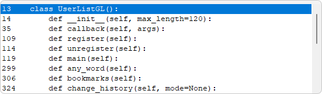

# UserListGotoLine

Searches the current buffer for lines of interest in Notepad++ and shows a user list that will goto to the line of the selected item.

The initial list can have these items:

```
any word style 0
bookmarks
change history
change history modified
change history reverted to modified
change history reverted to origin
change history saved
codes
codes extended
codes uppercase
comments
comments block
comments doc
comments docline
comments nested
comments reminder
current char style 0
current selection
current selection style 0
current word
current word style 0
folds
log
log error
log fatal
log timestamp
log warn
```

Some items may not be shown if no selection exists, Change History is turned off, ...

 * any word style 0
   * List lines that match any word in the detected style number and goto selected line. 
 * bookmarks
   * List bookmark lines and goto selected line.
 * change history
   * List all change history lines and goto selected line.
 * change history modified
   * List modified change history lines and goto selected line.
 * change history reverted to modified
   * List reverted to modified change history lines and goto selected line.
 * change history reverted to origin
   * List reverted to origin change history lines and goto selected line.
 * change history saved
   * List saved change history lines and goto selected line.
 * codes
   * List matched code lines and goto selected line.
 * codes extended
   * List matched code lines with an extended pattern and goto selected line.
     Setup for Batch, Inno, Lua and Swift.
 * codes uppercase
   * List matched code lines and with an uppercase word pattern and goto selected line.
     Targets what is known as code constants.
     Example: `ABC_7` is valid in a language preset style.
     Setup for Au3, Bash, CoffeeScript, C#, D, GDScript, Go, Inno, Java, JavaScript, Lua, Matlab, Perl, PHP, Powershell, Python, Raku, Ruby, Rust and Swift.
 * comments
   * List comment lines and goto selected line.
 * comments block
   * List comment block lines and goto selected line.
     Setup for Au3, C, C++, C#, EScript, FreeBasic, GDScript, Go, Java, JavaScript, Lua, MSSQL, PHP, Powershell, Python, Raku, Ruby, Rust, SQL and Swift.
 * comments doc
   * List comment document lines and goto selected line.
     Setup for C, C++, C#, COBOL, FreeBasic, Go, Java, JavaScript, Raku, Rust, SQL and Swift.
 * comments docline
   * List comment single line document lines and goto selected line.
     Setup for D.
 * comments nested
   * List comment nested document lines and goto selected line.
     Setup for D.
 * comments reminder
   * List lines containing `debug:`, `reminder:`, `todo:` in line comments and goto selected line.
     Lines of code with end of line comments can be in the list.
 * current char style 0
   * List lines that match current char in the detected style number and goto selected line.
 * current selection
   * List lines that match selection and goto selected line.
 * current selection style 0
   * List lines that match selection in the detected style number and goto selected line.
     Must be word characters matched by re.match `^\w+$` so can be part of a word.
     Added provided it has good use though could change to improve or be removed if it has issues.
 * current word
   * List lines that match current word and goto selected line.
 * current word style 0
   * List lines that match current word in the detected style number and goto selected line.
 * folds
   * List fold lines and goto selected line.
 * log
   * List lines containing `error`, `fatal` and `warn` word variants and goto selected line.
     Files of the type `.log` are recognized.
 * log error
   * List lines containing word `error` variants and goto selected line.
 * log fatal
   * List lines containing word `fatal` and goto selected line.
 * log timestamp
   * List lines with timestamps and goto selected line.
     Language text with `.LOG` on first line which causes Notepad.exe to auto-insert timestamps.
     If timestamp format re pattern is unspecified in `__init__`, then the next non-empty line will be read to create a re pattern.
     The created re pattern will detect lines with only a timestamp, though specifying a re pattern will let the user decide the conditions.
     View [DotLogTimestamp.py source] to use `.LOG` with Notepad++ using the PythonScript plugin.
 * log warn
   * List lines containing word `warn` variants and goto selected line.

An example showing the codes list:



The same format is used for the other lists. The integers on the left are line numbers. The remainder is the line text.

Languages setup for style detection currently:

```
Ada
Assembly
AutoIt
AviSynth
Batch
C             (no codes)
C#
C++           (no codes)
CMake
COBOL
CoffeeScript
CSS
D             (basic codes)
Diff
EScript       (no codes)
Fortran
FreeBasic
GDScript
Go
HTML
INI file
Inno Setup
Java
JavaScript
JSON
Lua
Makefile
Matlab
MMIXAL
MSSQL
Nim
NSIS
Pascal
Perl
PHP
Powershell
Properties
Python
Raku
Registry
Resource file
Ruby
Rust
Shell
SQL
Swift
TOML
User: dBASEPlus
User: Markdown
User: NppExec
Visual Basic
XML
```

Items like bookmarks, change history, ... where style detection is not required can work for any language.

Note that Notepad++ >= v8.7.6 will [style the whole document] by default rather than the previous setting of style only of what is shown. Scrolling in later versions may not be needed initially to style the whole document.

Searching by default is case sensitive unless overridden. So current word search for `WORD` will find `WORD` and will not find `word`.

Selections other than a main stream selection are not currently handled so attempts at using other selection types may show undesirable results.

Lines of text added to the list will be maximum 120 characters so long lines may look incomplete. Passing a parameter to the existing called class named `UserListGL()` like for example

```
        user_list_gl = UserListGL(150)
```

will increase the maximum to 150 characters.

[PythonScript] plugin:

 * v3.0.21.0 tested as OK.
 * v2.1.0.0 tested and seems OK.
 * v2.0.0.0 is not supported as it is missing some needed functions.

 [DotLogTimestamp.py source]: https://community.notepad-plus-plus.org/post/87539
 [PythonScript]: https://github.com/bruderstein/PythonScript
 [style the whole document]: https://github.com/notepad-plus-plus/notepad-plus-plus/blob/8042e50b1979cf958c8a2fbd46e06f819ab30fb2/PowerEditor/src/ScintillaComponent/ScintillaEditView.cpp#L234
